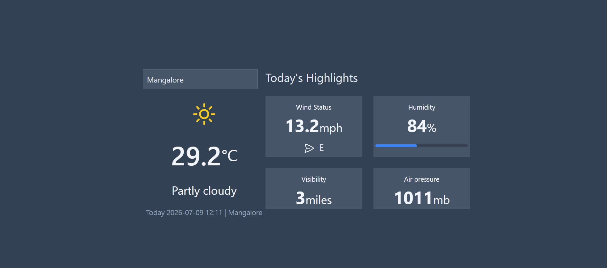
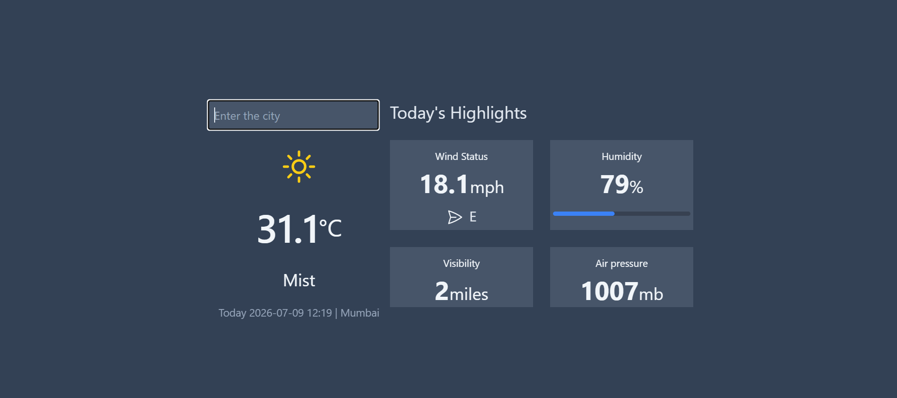
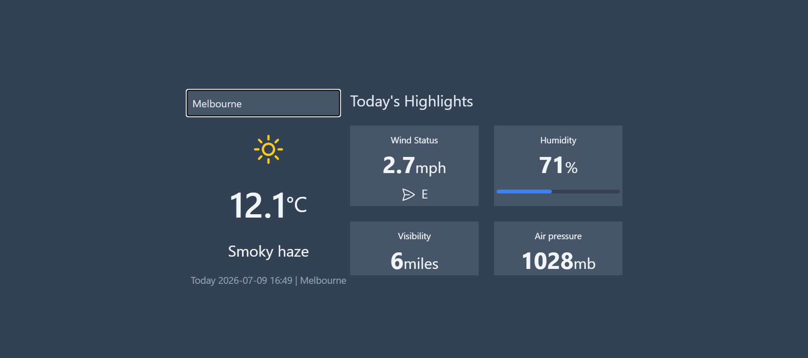

# 🌤️ Weather App

A real-time weather dashboard built with React.js and the WeatherAPI. Search any city in the world and instantly get live weather conditions including temperature, wind status, humidity, visibility and air pressure.



## 🔗 Live Demo
[View Live Site](https://weather-app-pratham-amin.vercel.app/)

## 🛠️ Built With

- React.js
- Vite (build tool)
- CSS3 / Tailwind CSS
- WeatherAPI (REST API)
- Async/Await (data fetching)
- Vercel (deployment)

## ✨ Features

- 🔍 Search weather by any city worldwide
- 🌡️ Live temperature in Celsius
- 🌤️ Current weather condition with icon
- 📍 Location and local date/time display
- 💨 Wind speed and direction
- 💧 Humidity with visual progress bar
- 👁️ Visibility in miles
- 🔵 Air pressure in millibars
- ⚡ Real-time data fetched on every search
- 🌙 Clean dark slate UI theme
- ⏳ Loading state while fetching data
- ❌ Error handling for failed requests

## 📸 Screenshots

### Dashboard


### Loading State


## 🚀 Getting Started

### Prerequisites
- Node.js installed
- Free API key from [WeatherAPI.com](https://weatherapi.com)

### Installation

1. Clone the repo
```bash
git clone https://github.com/pratham-amin/WeatherApp.git
```

2. Navigate to the project folder
```bash
cd weather-app
```

3. Install dependencies
```bash
npm install
```

4. Create a `.env` file in the root folder
```bash
VITE_WEATHER_KEY=your_api_key_here
```

5. Start the development server
```bash
npm run dev
```

6. Open your browser and visit
```bash
http://localhost:5173
```

### Get a Free API Key
1. Go to [weatherapi.com](https://weatherapi.com)
2. Sign up for a free account
3. Copy your API key from the dashboard
4. Paste it into your `.env` file

### Build for Production
```bash
npm run build
```

## 🌐 How It Works

1. App loads with default city — **Mangalore**
2. WeatherAPI is called via `fetch` with `async/await`
3. Response data is stored in React state via `useState`
4. Components re-render with live weather data
5. User searches a new city → state updates → API called again → UI updates

## 🧩 Components

| Component | Description |
|---|---|
| `App.js` | Root component, manages state and API fetch |
| `Temp.js` | Displays city search input, temperature, condition icon, location and time |
| `Highlights.js` | Reusable card component displaying individual weather stats |

## 📊 Weather Data Displayed

| Stat | Unit |
|---|---|
| Temperature | °C |
| Condition | Text + Icon |
| Wind Speed | mph |
| Wind Direction | Compass (N/S/E/W) |
| Humidity | % with progress bar |
| Visibility | miles |
| Air Pressure | mb |

## 🔐 Environment Variables

| Variable | Description |
|---|---|
| `VITE_WEATHER_KEY` | Your WeatherAPI.com API key |

Never commit your `.env` file. It is already excluded via `.gitignore`.

Update your `App.js` to use the Vite environment variable:

```javascript
const apiurl = `https://api.weatherapi.com/v1/current.json?key=${import.meta.env.VITE_WEATHER_KEY}&q=${city}&aqi=no`;
```

## 👨‍💻 About the Developer

Built by **Pratham Sathish** — Frontend Developer and MIT student at Deakin University, Burwood.

- 📍 Burwood, VIC, Australia
- 📧 sprathamamin23@gmail.com
- 💼 [LinkedIn](https://linkedin.com/in/pratham-s-5a3856290)
- 💻 [GitHub](https://github.com/pratham-amin)
- 🌐 [Portfolio](https://portfolio-pratham-amin.vercel.app/)

